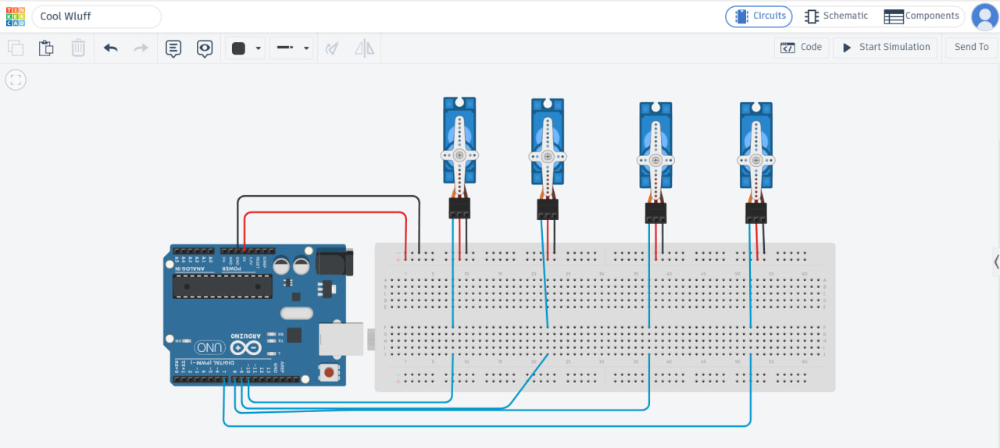

# Four Servo Control

Arduino-based control system for four servo motors performing a synchronized sweep motion for 2 seconds, followed by a 90° hold position.

## Overview

This project demonstrates synchronized control of four servo motors using an Arduino Uno.

The system performs two main actions:

1. All four servo motors execute a sweep motion between 0° and 180° for 2 seconds.
2. After the sweep motion is completed, all servo motors move to and hold a 90° position.

## Components

- Arduino Uno
- 4 × Servo Motors
- Breadboard
- Jumper Wires
- Tinkercad Circuits

## Servo Connections

| Servo | Signal Pin |
|------|------|
| Servo 1 | D7 |
| Servo 2 | D8 |
| Servo 3 | D9 |
| Servo 4 | D10 |

All servo motors share the Arduino 5V and GND connections through the breadboard.

## How It Works

The Arduino uses the Servo library to control the angular position of each motor.

During the first 2 seconds, the motors perform a synchronized sweep motion from 0° to 180° and back.

After 2 seconds, the sweep motion stops and all four motors are positioned at 90°.

## Simulation

The circuit was designed and tested using Tinkercad Circuits.

## Circuit Diagram

The following circuit was designed and simulated using Tinkercad Circuits.



## Project Structure

```text
four_Servo_Control/
├── README.md
├── servo_control.ino
├── images/
└── demo/
